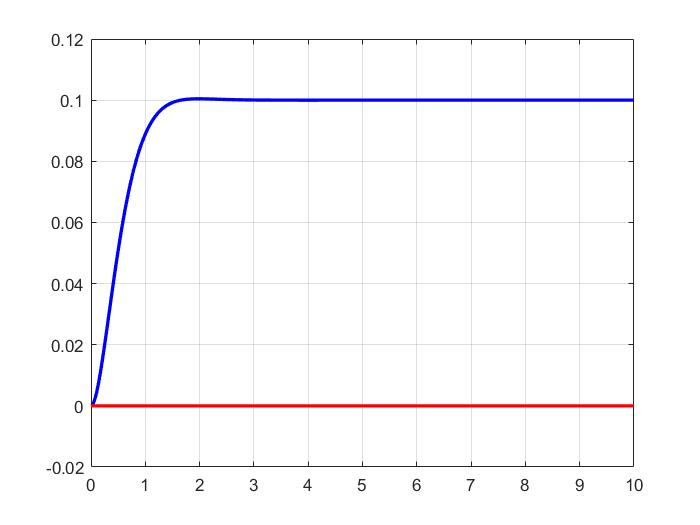

# 🚁 Flight-Controller: Quadcopter Control using LQR in MATLAB

This repository provides a basic simulation of a **quadrotor (quadcopter) control system** using **Linear Quadratic Regulator (LQR)** optimal control. The system models the translational and rotational dynamics of a simplified quadcopter and uses LQR to stabilize and control position and attitude.

---

## 📌 Features

* Implements an LQR controller for a simplified 2D quadcopter model.
* Simulates step response of the quadcopter position and orientation.
* Plots position and angle over time to visualize control performance.
* Fully implemented in MATLAB for simulation and analysis.

---

## 🧠 System Model

The state-space model includes:

* States:
  `[x, ẋ, θ, θ̇]` → position, velocity, angle, angular rate

* Control Inputs:
  `[F, τ]` → thrust force and torque

* Matrices:

  ```
  A = [0 1 0 0;
       0 0 0 0;
       0 0 0 1;
       0 0 0 0];

  B = [0   0;
       1/m 0;
       0   0;
       0 1/I];
  ```

---

## 🧮 LQR Control

* Weighting Matrices:

  ```matlab
  Q = diag([10, 1, 10, 1]);   % penalizes deviations in position and angle
  R = 0.1 * eye(2);           % penalizes high control input
  ```

* LQR computes gain matrix `K`:

  ```matlab
  [K, S, E] = lqr(A, B, Q, R);
  ```

* Closed-loop system:

  ```
  Ac = A - B*K
  ```

---

## 📊 Output Example

The code simulates a step input and plots:

* Blue: Position over time
* Red: Orientation angle over time

<p align="center">
  
</p>

---

## 🚀 Getting Started

### ✅ Requirements

* MATLAB (R2021a or newer recommended)

### ▶️ How to Run

1. Clone the repository:

   ```bash
   git clone git@github.com:andyyounes/Flight-controller.git
   cd Flight-controller
   ```

2. Open `Quadcopter_control_with_LQR.m` (or your script) in MATLAB.

3. Click **Run** to execute the simulation.

---

## 🗂️ Files

| File               | Description                            |
| ------------------ | -------------------------------------- |
| `Quadcopter_control_with_LQR.m` | Main simulation script for LQR control |
| `README.md`        | Project documentation                  |

---

## 📚 References

* Kalman, R. E. (1960). "Contributions to the theory of optimal control".
* Stevens & Lewis. "Aircraft Control and Simulation".
* MATLAB documentation: [`lqr()` function](https://www.mathworks.com/help/control/ref/lqr.html)

---

